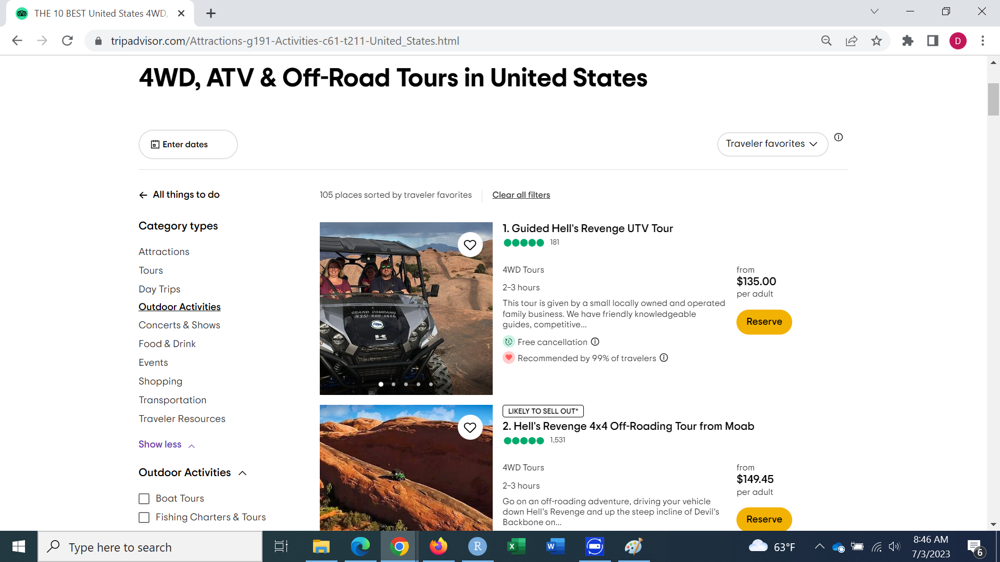

```{r echo=FALSE, warning=FALSE, message=FALSE}
library(tidyverse)

```

Are you an ATV tour company or a business in the bustling tourism industry? Unlock the key insights that can take your business to new heights with our comprehensive analysis. We have delved into the world of customer reviews for ATV tours, extracting valuable findings to help you thrive in this competitive landscape.

In this tailored analysis designed for ATV tour companies and other businesses in the tourism industry, we bring you a wealth of actionable information. Discover the factors that contribute to customer satisfaction, drive positive reviews, and ultimately boost your business.

By analyzing customer reviews from trusted platforms like TripAdvisor, we have uncovered fascinating patterns. Learn how attributes like being "friendly," "knowledgeable," and providing a great experience can significantly impact customer satisfaction. We also delve into the aspects that may have a negative influence, such as pricing and time-related considerations.

But our analysis goes beyond mere insights. We provide you with practical strategies to translate these findings into tangible results. From optimizing your guide training programs to refining pricing strategies and tour durations, we offer guidance to help you unlock your business's full potential.

Stay ahead of the competition by harnessing the power of customer feedback. Our analysis empowers you to enhance customer satisfaction, attract positive reviews, and drive growth for your ATV tour company or tourism-related business.

Don't miss out on this opportunity to transform your business. Let our analysis be your compass as you navigate the dynamic world of ATV tours and the tourism industry. Elevate your business to new heights and captivate the adventurous hearts of customers seeking unforgettable experiences.

## Data

Using my expertise in data analysis and programming, I developed a custom R code specifically designed to scrape data from tripadvisor.com. This popular website serves as a go-to resource for vacation planning, providing users with a wide array of information on various outdoor activities. By leveraging the filtering capabilities on the left side of the screen, individuals can narrow down their search to specific categories, such as 4WD, ATV & Off-Road Tours. As a result, the code successfully retrieves a comprehensive dataset of 110 tours in the United States. Notably, each tour includes a detailed information page, accompanied by customer reviews and ratings, enabling thorough analysis and valuable insights into the quality of the tour packages. The retrieved dataset includes nearly 35,000 customer reviews for ATV tours.

{width=100%}


## Analysis

### Map of ATV Tours and Their Characteristics

Tour operators can leverage this interactive map to gain valuable insights into the ATV tour landscape across the United States. By hovering over specific locations on the map, operators can access detailed information about each ATV tour, including ratings and key characteristics.

The map employs a color scheme that represents the average ratings of the tours, with dark blue indicating higher ratings and dark red representing lower ratings. This allows operators to quickly assess the overall quality of the tours in different areas and make informed comparisons.

In addition to the ratings, the map also highlights key characteristics shared by the tours. This feature enables operators to easily compare different options based on factors such as average customer ratings, pricing, duration, and other relevant details. By considering these characteristics, operators can make well-informed decisions that align with their target market and business goals.

The interactive nature of the map provides further functionality. Operators can zoom in on specific regions or cities by clicking on the plus sign, '+', located in the upper right corner of the map. This zoom feature is particularly useful when examining ATV tours in Hawaii, where many tours focus on small areas with unique terrain and natural features. By zooming in, operators can gain a deeper understanding and evaluation of the ATV tours available in Hawaii.

The interactive map serves as a valuable tool for tour operators, offering a comprehensive overview of the ATV tour market in the United States. By leveraging the provided information, operators can strategically position their own offerings and make data-driven decisions to enhance their ATV tours, providing customers with an exceptional experience tailored to their preferences.

```{r echo=FALSE, warning=FALSE, message=FALSE}
map <- read_rds("../../../../OHRV_tour_reviews/00_data/fig/map.rds")
map
```

### ATV Tour Characteristics

The following plot depicts the count of ATV tours in the United States based on specific offerings. For instance, if you are contemplating whether to provide a full refund policy, the plot reveals that out of 110 ATV tours, 100 of them offer a full refund if cancelled at least 24 hours prior to the event. This information can aid in making strategic decisions when positioning your own offerings in the market.

By analyzing the plot, tour operators can gain insights into the prevailing industry practices and identify areas where they can differentiate their offerings. Understanding the landscape of ATV tours in terms of specific features and policies allows operators to make informed choices that align with customer expectations and contribute to their business success.

```{r echo=FALSE, warning=FALSE, message=FALSE}
counts_of_char_fig <- read_rds("../../../../OHRV_tour_reviews/00_data/fig/counts_of_char_fig.rds")
counts_of_char_fig
```

### Price and Customer Ratings

The presented boxplot provides preliminary evidence suggesting a potential relationship between price and customer satisfaction in the ATV tour industry. The boxes in the plot represent the middle 50% of the ratings within specific price ranges, while the vertical line within each box represents the median rating, which indicates the typical rating for that particular price bin.

Based on the boxplot, there is an indication that higher-priced ATV tours may have lower customer satisfaction compared to lower-priced ones. For example, the typical rating for the price range of \$100 to \$200 is lower than the typical rating for tours priced below \$100.

While this observation provides initial insight, further analysis and examination of additional data would be necessary to establish a stronger correlation between price and customer satisfaction in the ATV tour industry. Nonetheless, this preliminary evidence highlights the importance of considering pricing strategies and their potential impact on customer satisfaction when positioning and pricing ATV tours.

```{r echo=FALSE, warning=FALSE, message=FALSE}
ratings_and_price_fig <- read_rds("../../../../OHRV_tour_reviews/00_data/fig/ratings_and_price_fig.rds")
ratings_and_price_fig
```

### Tour Duration and Customer Ratings

The depicted boxplot offers preliminary evidence suggesting that tour duration could be a significant factor in customer satisfaction within the ATV tour industry. The plot indicates that there may be an optimal "sweet spot" for tour duration, with tours lasting between 2 to 4 hours receiving higher ratings from customers.

Furthermore, the boxplot suggests that tours between 4 and 6 hours in duration tend to have lower customer satisfaction ratings. This implies that longer tours may potentially result in decreased satisfaction among customers.

While this observation provides initial insights, further analysis and examination of additional data would be necessary to establish a stronger relationship between tour duration and customer satisfaction in the ATV tour industry. Nonetheless, this preliminary evidence emphasizes the importance of considering and optimizing tour duration to ensure higher levels of customer satisfaction.

```{r echo=FALSE, warning=FALSE, message=FALSE}
ratings_and_duration_fig <- read_rds("../../../../OHRV_tour_reviews/00_data/fig/ratings_and_duration_fig.rds")
ratings_and_duration_fig
```

### ATV Tour Characteristics and Customer Ratings

The presented plot illustrates the simple correlations between various common features of ATV tours and customer ratings. One notable finding is that tours offering a full refund policy tend to receive higher ratings compared to those that do not provide such an option.

This correlation suggests that the availability of a full refund policy positively influences customer satisfaction and subsequently leads to higher ratings. It indicates that customers value the flexibility and assurance that comes with the ability to receive a full refund in case of cancellation or changes to their plans.

It is important to note that this plot represents simple correlations and does not establish causation between the features and customer ratings. Further analysis and consideration of additional factors are necessary to obtain a comprehensive understanding of the relationship between different ATV tour features and customer satisfaction.

However, based on the displayed correlations, tour operators may consider implementing a full refund policy as a potential strategy to enhance customer satisfaction and improve their overall ratings.

```{r fig.height=10, echo=FALSE, warning=FALSE, message=FALSE}
ratings_and_tour_char_fig <- read_rds("../../../../OHRV_tour_reviews/00_data/fig/ratings_and_tour_char_fig.rds")
ratings_and_tour_char_fig
```

### Customer Reviews Analysis

The presented bar chart displays the most frequently mentioned topics in nearly 35,000 customer reviews for ATV tours. The analysis reveals that the word "guide" stands out as the most frequently used term. This prominence indicates the significance customers place on the quality and competence of the tour guides. It underscores the importance of investing in guide training and ensuring their proficiency, as they play a critical role in the overall customer experience.

Additionally, the chart indicates the presence of time-related words such as 'time', 'hour', and 'minute'. This observation suggests that tour operators should pay close attention to the duration of the ATV tours. Finding the optimal balance between tour duration and customer satisfaction is crucial, as indicated by the customers' emphasis on these time-related aspects.

Furthermore, the chart reveals that customers frequently mention words associated with the overall experience, such as 'experience', 'stop', 'view', and 'picture'. This indicates that customers value the overall experience of the ATV tour, including the opportunity to make stops, enjoy scenic views, and capture memorable pictures.

By analyzing the most frequently mentioned topics in customer reviews, tour operators can gain valuable insights into the aspects that have a significant impact on customer satisfaction. This information can guide operators in prioritizing investments in guide training, optimizing tour duration, and creating memorable experiences that align with customer expectations.

```{r echo=FALSE, warning=FALSE, message=FALSE}
frequent_topics_fig <- read_rds("../../../../OHRV_tour_reviews/00_data/fig/frequent_topics_fig.rds")
frequent_topics_fig
```

The text analysis of customer reviews for ATV tours, obtained from tripadvisor.com, uncovered interesting associations between certain words and customer review ratings. The analysis revealed that words such as "great," "friendly," "knowledgeable," and "informative" are positively associated with higher customer review ratings. This suggests that customers value these qualities in their tour guides and consider them important factors contributing to their overall satisfaction.

On the other hand, the analysis also found that words related to "money" and time-related terms like "hours" and "minutes" are negatively associated with customer reviews. This implies that customers may express dissatisfaction when they perceive the tour to be lacking value for the price paid or when they feel that the tour duration was inadequate.

These findings provide actionable insights for ATV tour operators. They can focus on training their guides to be friendly, knowledgeable, and informative to enhance the customer experience. Additionally, operators should carefully consider pricing strategies to ensure customers feel they are receiving good value for their money. Furthermore, optimizing tour durations and managing customer expectations regarding time spent on the tour can contribute to improved customer satisfaction.

By leveraging these insights, ATV tour operators can make informed decisions to address areas of improvement and enhance the overall customer experience, leading to higher customer review ratings and increased customer satisfaction.

```{r echo=FALSE, warning=FALSE, message=FALSE}
network_of_words_in_reviews_fig <- read_rds("../../../../OHRV_tour_reviews/00_data/fig/network_of_words_in_reviews_fig.rds")
network_of_words_in_reviews_fig
```

Based on the analysis of the ATV tour customer reviews, there are several actionable insights you can derive:

1.  Emphasize the qualities highlighted in positive reviews: The words "great," "friendly," "knowledgeable," and "informative guide" were positively associated with higher customer review ratings. This suggests that customers value these aspects of their experience. To improve customer satisfaction, prioritize hiring and training guides who possess these qualities and encourage them to engage with customers in a friendly and informative manner.

2.  Address concerns related to money and time: The negative association of words like "money," "hours," and "minutes" with customer reviews suggests that customers may have had concerns about the cost and time spent during the ATV tour. To address this, consider reviewing your pricing structure to ensure it is competitive and transparent. Additionally, focus on managing customer expectations regarding the duration of the tour and provide clear information upfront about the time commitment involved.

3.  Gather feedback on pricing and time-related aspects: In order to gain deeper insights into customers' concerns regarding money and time, consider implementing mechanisms to collect feedback specifically related to these aspects. This could include post-tour surveys or feedback forms that specifically ask about pricing satisfaction, duration expectations, and overall value for money. Analyzing this feedback can help you identify specific areas for improvement.

4.  Highlight positive customer experiences in marketing materials: Since words like "great," "friendly," and "knowledgeable" were associated with positive customer reviews, leverage these sentiments in your marketing efforts. Use customer testimonials that emphasize these qualities in your website, social media, and promotional materials. This can help potential customers gain confidence in the quality of your ATV tours.

5.  Continuous training and monitoring of guides: Invest in ongoing training programs for your ATV tour guides to enhance their knowledge, customer service skills, and overall performance. Regularly monitor and evaluate their interactions with customers to ensure they consistently deliver a positive experience. Encourage feedback from customers to identify areas where guides can improve further.

6.  Improve communication and transparency: To address concerns related to money and time, focus on improving communication with customers. Provide clear and transparent information about pricing, inclusions, and any additional costs involved. Clearly communicate the duration of the tour, including any potential variations, to manage customer expectations effectively.

By implementing these actionable insights, you can work towards enhancing customer satisfaction, addressing concerns, and improving the overall ATV tour experience.

## Quantifying Insights in Tangible Value.

Quantifying these insights can pose challenges that vary based on the size of the company and the niche market it operates in. Nevertheless, I have endeavored to tackle this task.

Using a machine learning model trained on data from tripadvisor.com, I have identified a significant opportunity to increase the likelihood of receiving positive reviews rated four stars or higher on a scale of 1-5 stars. By analyzing specific customer reviews, such as one expressing dissatisfaction with a tour guide's lack of knowledge and poor adherence to the tour description, the model predicted a low chance of receiving a favorable rating.

However, when substituting that negative review with a positive one stating that the guide was knowledgeable and friendly, the model predicted a substantial increase in the probability of receiving a high rating. This shift in customer perception resulted in a near-guarantee of converting a negative review into a positive one.

Investing resources in training and securing knowledgeable and friendly guides can have a profound impact on your business. By addressing this key aspect, you can significantly reduce the likelihood of negative reviews, thereby retaining potential customers who may have otherwise chosen a different company.

To illustrate the potential gains, let's consider a hypothetical business serving 1,000 customers annually at a price point of \$200 per person. If one negative review causes one out of every ten potential customers to choose a competitor, a simple calculation suggests that your business has the potential to gain \$20,000 per year (100 \* \$200).

Furthermore, considering that the estimated customer lifetime value is typically 3-5 times the annual value, the total gains could amount to a substantial range of \$60,000 to \$100,000. It is important to note that the magnitude of these gains directly correlates with the number of negative reviews mitigated. The more negative reviews you can prevent through improved guide training, the greater the potential for significant revenue gains.

By prioritizing the development of knowledgeable and friendly guides, your tour company can create a positive customer experience, attract more positive reviews, and ultimately drive substantial increase in sales and business growth.

# Summary

In conclusion, customer reviews are a valuable source of information that can have a profound impact on the bottom line of your business. The analysis presented in this report demonstrates the potential for significant improvements in customer satisfaction and financial success by leveraging insights derived from customer feedback.

While this analysis specifically focuses on ATV tour companies, the principles and findings can be applied to other businesses within the tourism industry as well. Whether you operate a hotel, a restaurant, or any other tourism-related business, understanding customer sentiments and addressing key areas of improvement can lead to enhanced customer satisfaction and increased profitability.

By harnessing the power of customer reviews and leveraging data-driven insights, businesses in the tourism industry can make informed decisions, optimize their offerings, and differentiate themselves from competitors. Providing exceptional experiences, addressing customer concerns, and delivering on customer expectations can result in positive reviews, repeat business, and word-of-mouth recommendations.

Remember, customer reviews are not just a reflection of past experiences; they hold the potential to shape the future success of your business. Embracing customer feedback and continuously striving for improvement will enable you to stay ahead in this dynamic industry.

So, whether you operate an ATV tour company or any other tourism-related business, take the insights from this analysis to heart. Embrace the power of customer reviews and let them guide you toward a more prosperous future, where customer satisfaction and business success go hand in hand.
