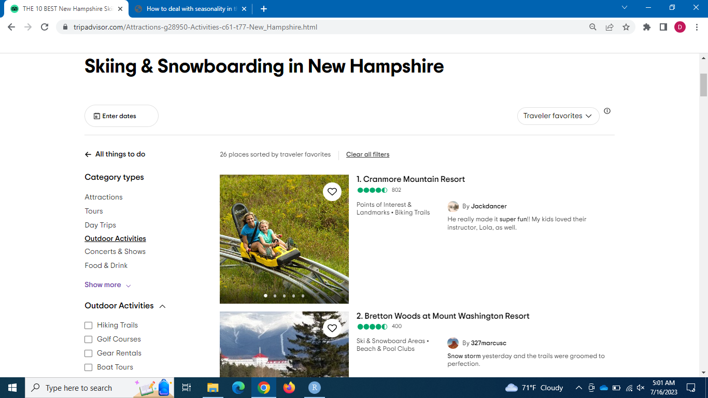

```{r echo=FALSE, warning=FALSE, message=FALSE}
library(tidyverse)

map <- read_rds("../../../../Ski_areas/00_data/fig/map.rds")
Ski_area_info_fig <- read_rds("../../../../Ski_areas/00_data/fig/Ski_area_info_fig.rds")
n_of_ski_areas_by_type_fig <- read_rds("../../../../Ski_areas/00_data/fig/n_of_ski_areas_by_type_fig.rds")
avg_n_of_ski_area_reviews_by_type_fig <- read_rds("../../../../Ski_areas/00_data/fig/avg_n_of_ski_area_reviews_by_type_fig.rds")
avg_rating_of_ski_areas_by_type_fig <- read_rds("../../../../Ski_areas/00_data/fig/avg_rating_of_ski_areas_by_type_fig.rds")
```

**Part 1: diversification within ski areas, examining how they expand their offerings beyond traditional winter activities**

The tourism industry is highly susceptible to fluctuations in demand, often driven by seasonality. Businesses operating in popular tourist destinations face the challenge of managing varying customer demands throughout the year. As a solution, many businesses are turning to data analysis techniques to gain valuable insights that can inform strategic decision-making.

In this data analysis report, we explore how a tourism business, with a specific focus on the ski industry, can effectively deal with seasonality using data scraped from TripAdvisor.com. While our analysis concentrates on the ski industry, the principles and approaches discussed here can be applied to other businesses within the broader tourism sector.

Our primary objective is to showcase the potential of data analysis in helping tourism businesses mitigate the impact of seasonality. The report is divided into four parts, each providing unique insights and actionable recommendations. In Part 1, we delve into the topic of diversification within ski areas, examining how they expand their offerings beyond traditional winter activities. Part 2, scheduled for next week, will explore the benefits of collaborating with nearby attractions and businesses to attract visitors throughout the year. In Part 3, the following week, we analyze customer reviews to gain a deeper understanding of their preferences and expectations, enabling businesses to tailor their offerings to different seasons effectively. Finally, in Part 4, set for release in four weeks, we will construct a machine learning model to identify the key variables that significantly impact customer ratings, allowing businesses to enhance their overall performance.

By adopting a data-driven approach, businesses in the tourism industry can gain a competitive advantage by understanding and adapting to the changing demands of their customers. Through the examination of real-world data and the application of analytical techniques, this report aims to provide practical insights and strategies that can be implemented by tourism businesses to thrive in the face of seasonality challenges.

## Data

By utilizing a custom-built R script, we retrieved a comprehensive dataset consisting of ski area information. To access the data used in this analysis, the audience can follow the instructions below:

1.  Visit the tripadvisor.com homepage.
2.  Perform a search for "ski areas in New Hampshire."
3.  Navigate through the search results to explore the various ski areas listed.
4.  Repeat the same process for Maine and Vermont to gather additional ski area information from these states.

Please note that the data available on tripadvisor.com is contributed by multiple sources, including ski areas themselves, tour agencies, and skiers who have visited these locations. Consequently, it is important to acknowledge that the data may not always be consistent, entirely accurate, or up-to-date. However, despite these limitations, the dataset serves as an invaluable real-world resource, offering actionable insights for businesses operating in the tourism industry.

For the purpose of this analysis, the data were accessed in July, 2023. We have included information from 58 ski areas located in the three northern New England states: New Hampshire, Vermont, and Maine. Our dataset encompasses over 13,000 customer reviews. However, to ensure statistical significance and reliable analysis, small ski areas with 10 customer reviews or less have been excluded from the dataset.

With this rich and diverse dataset at our disposal, we embark on a journey to unravel the intricacies of the ski industry, allowing us to extract valuable insights and propose innovative solutions to overcome the challenges posed by seasonality.

{width=100%}

## Map of Ski Areas

Ski areas can leverage the interactive map below to gain valuable insights into the ski industry landscape in the northern New England states. By hovering over specific locations on the map, operators can access detailed information about each ski area, including ratings and types of offerings. Furthermore, the interactive map offers a zoom functionality that allows operators to focus on specific regions of interest. By clicking on the plus sign, '+', located in the upper right corner of the map, operators can zoom in and examine smaller areas of multiple ski areas. This zoom feature proves particularly useful when exploring regions with a high concentration of ski areas, such as southern Vermont.Please click the reset button to revert the map back to its original state.

Diversification within the ski industry extends beyond singular categories or types of offerings. Ski areas often provide multiple categories or types of experiences to cater to a broader range of customers. For instance, let's take the example of Loon Mountain Resort in New Hampshire, which offers two distinct types of offerings: (1) Zipline & Aerial Adventure Parks and (2) Ski and Snowboard Areas.

This exemplifies how ski areas can expand their scope by providing various activities and attractions alongside their traditional skiing and snowboarding offerings. By incorporating ziplines, aerial adventure parks, and other recreational options, ski areas can appeal to a wider customer base and attract visitors throughout the year, even beyond the winter season.

The interactive map provides a comprehensive view of the ski industry landscape, allowing operators to explore the diverse categories or types of offerings available at each ski area. This information empowers operators to analyze the variety of experiences provided by ski areas, identify potential areas for diversification, and make informed decisions to enhance their own business models.

As we delve further into this analysis, we will explore additional examples and strategies for diversification within the ski industry. By understanding the multi-faceted nature of ski areas' offerings, operators can strategically position their own businesses and capitalize on opportunities to attract a wider customer base, effectively managing seasonality challenges in the tourism industry.

```{r  echo=FALSE, warning=FALSE, message=FALSE, fig.width=8, out.width="100%"}
map
```

## Analysis

### Overview

The plot below provides an overview of the ski industry landscape in the three northern New England states. Vermont leads the pack with the highest number of ski areas, boasting a total of 26, while Maine has the fewest with 11 ski areas included in the dataset. It is important to note that the data does not include small ski areas with 10 customer reviews or less, ensuring statistical reliability.

Interestingly, there doesn't appear to be a significant difference in customer satisfaction levels among the three states, as indicated by the average customer ratings. If anything, Maine has a slightly higher average rating of 4.4, compared to 4.3 for both New Hampshire and Vermont. This suggests that ski areas in Maine may have slightly outperformed their counterparts in terms of customer satisfaction.

Furthermore, the average number of customer reviews provides insight into the relative popularity of ski areas in each state. On average, ski areas in New Hampshire have a higher number of customer reviews compared to those in Vermont and Maine. The number of customer reviews can serve as a proxy for popularity, indicating the size and reach of the user base or the effectiveness of marketing efforts. It demonstrates that ski areas in New Hampshire have garnered more attention and engagement from customers, potentially attracting a larger customer base.

The customer reviews are aggregated and averaged for each individual ski area, and then further averaged for each state, providing a comprehensive representation of the overall customer sentiment within the ski industry.

This analysis highlights the overall landscape of the ski industry in the three states, shedding light on the distribution of ski areas, customer satisfaction levels, and popularity based on customer reviews.

```{r echo=FALSE, warning=FALSE, message=FALSE, out.width="100%"}
Ski_area_info_fig
```

### Number of Ski Areas by Types

The heatmap below provides insights into the diverse offerings available in the ski industry across the three northern New England states. These offerings go beyond the traditional ski and snowboard areas, encompassing a total of 18 different types of experiences. The heatmap serves as a valuable resource for ski areas to explore potential avenues for diversifying their revenue streams and expanding their services.

Notably, all three states offer beach and pool clubs as a type of offering, indicating the popularity of this particular experience among visitors. This suggests that ski areas could consider incorporating beach and pool club amenities to attract a broader range of customers and extend their appeal beyond the winter season.

The heatmap also reveals variations in offerings among the northern New England states' ski areas. New Hampshire stands out with unique experiences like Zipline & Aerial Adventure Parks, State Parks, Points of Interest & Landmarks, Horseback Riding Tours, and Geologic Formations. Vermont distinguishes itself with offerings such as Valleys, Specialty & Gift Shops, Parks, Lookouts, and Hiking Trails, highlighting the state's focus on natural beauty and recreational opportunities. Meanwhile, Maine stands alone with a ski area offering Breweries, showcasing its commitment to combining skiing with the exploration of local breweries and the craft beer scene. These distinct offerings reflect each state's efforts to differentiate their ski areas and cater to diverse visitor interests.

The heatmap underscores the importance of diversification in the ski industry, offering ski areas valuable insights into potential opportunities for expanding their services and attracting a wider customer base. By leveraging the available data and identifying types of offerings that are currently absent or less prevalent in their respective states, ski areas can strategically position themselves to stand out and cater to different customer preferences.

```{r echo=FALSE, warning=FALSE, message=FALSE, out.width="100%"}
n_of_ski_areas_by_type_fig
```

### Avg. Number of Customer Reviews by Types

The second heatmap below provides insights into the average number of customer reviews, serving as an indicator of popularity, the size or reach of the user base, and the effectiveness of marketing efforts. It is important to note that the average counts are based on one or two ski areas beyond the ski and snowboard area type, so the interpretation should be taken with caution.

In the New Hampshire column, several cells shine brightly with over 800 reviews, suggesting that ski areas offering Biking Trails, Points of Interest & Landmarks, and Zipline & Aerial Adventure Parks have been successful in attracting a broad customer base and generating significant engagement. This indicates that these types of offerings have resonated well with visitors, leading to a higher number of reviews and potentially greater popularity.

Furthermore, the heatmap highlights certain types of offerings that seem to struggle in gaining traction. Notably, Breweries, Gear Rentals, Geologic Formations, Parks, and Specialty & Gift Shops show relatively lower review counts compared to other types. This could indicate that ski areas offering these experiences may need to refine their marketing strategies, enhance visibility, or better communicate the unique value they offer to attract more customers and encourage them to leave reviews.

Understanding the average number of customer reviews provides ski areas with insights into their relative popularity and customer engagement. By focusing on types that have garnered higher review counts and addressing the underperforming types, ski areas can refine their marketing efforts, improve customer satisfaction, and ultimately enhance their bottom line.

```{r echo=FALSE, warning=FALSE, message=FALSE, out.width="100%"}
avg_n_of_ski_area_reviews_by_type_fig
```

### Avg. Ski Area Ratings by Types

The last heatmap below provides insights into the average customer rating for each type of ski area. The customer ratings were aggregated and averaged to determine the overall average rating for each ski area, and these individual ski area averages were further averaged to calculate the average rating for each type of ski area. The customer rating serves as a measure of customer satisfaction and overall experience.

Notably, three types of ski areas stand out as the darkest cells, indicating a rating below four: Breweries, Gear Rentals, and Specialty & Gift Shops. This finding aligns with the observations from the previous heatmap regarding the average number of ski area reviews. Ski areas offering these types of experiences may need to reevaluate their offerings and address any issues affecting customer satisfaction. By enhancing the quality, value, or overall experience of these offerings, ski areas can strive to improve customer ratings and increase customer satisfaction.

Interestingly, there are cases where types with low engagement in terms of review counts in the previous heatmap received high ratings. Both Geologic Formations and Parks scored 4.7 or higher in customer ratings. This suggests that the low count of customer reviews for these two types likely reflects the size or scale of the ski areas rather than the quality of the offerings themselves. Ski areas offering these types may have smaller visitor numbers but receive positive feedback and high ratings from the customers who do engage with these unique experiences.

The insights gained from this heatmap allow ski areas to evaluate their performance and make informed decisions to enhance customer satisfaction. Ski areas offering types with lower ratings can focus on improving the quality, value, and overall customer experience to elevate their ratings and attract more positive reviews. Conversely, ski areas offering types with high ratings can leverage their positive reputation to further enhance their offerings and continue delivering exceptional experiences to customers.

```{r echo=FALSE, warning=FALSE, message=FALSE, out.width="100%"}
avg_rating_of_ski_areas_by_type_fig
```

## Actionable Insights

The comprehensive analysis of the heatmaps provides ski areas with actionable insights to drive improvements and enhance their business strategies. By considering the findings from all the plots, ski areas can leverage the following actionable insights:

1.  Diversify Offerings Strategically: The heatmap depicting variations in offerings highlights the importance of diversification to attract a wider customer base and manage seasonality. Ski areas can identify types of offerings that have gained traction in neighboring states, such as Zipline & Aerial Adventure Parks in New Hampshire and Valleys in Vermont, and consider incorporating them into their own offerings. This strategic diversification can help ski areas differentiate themselves, attract more visitors, and broaden revenue streams.

2.  Enhance Marketing Efforts: The average number of customer reviews heatmap reveals insights into the popularity and customer engagement of different types of offerings. Ski areas offering Breweries, Gear Rentals, Geologic Formations, Parks, and Specialty & Gift Shops should focus on refining their marketing strategies to increase visibility and communicate their unique value proposition effectively. By improving marketing efforts and encouraging customers to share their experiences through reviews, ski areas can enhance their online presence and attract a larger customer base.

3.  Improve Customer Satisfaction: The heatmap displaying average customer ratings allows ski areas to evaluate their performance and identify areas for improvement. Ski areas offering types with lower ratings, such as Breweries, Gear Rentals, and Specialty & Gift Shops, should prioritize enhancing the quality, value, and overall experience of these offerings. By addressing any issues affecting customer satisfaction, ski areas can strive to improve ratings, increase customer loyalty, and generate positive word-of-mouth recommendations.

4.  Capitalize on Unique Offerings: Ski areas can leverage their distinctive offerings, as identified in the heatmaps, to create memorable and differentiated experiences. For instance, ski areas in New Hampshire can capitalize on their successful offerings like Biking Trails, Points of Interest & Landmarks, and Zipline & Aerial Adventure Parks to attract a broader customer base. Similarly, ski areas in Maine can highlight their Breweries offering as a unique experience that combines skiing with the exploration of local craft beer culture. By emphasizing and promoting these unique offerings, ski areas can attract visitors seeking novel and immersive experiences.

5.  Focus on Customer Feedback: Ski areas should continuously monitor and analyze customer reviews to gain insights into their strengths, weaknesses, and opportunities. By listening to customer feedback, ski areas can address concerns, identify areas for improvement, and adapt their offerings to better align with customer preferences. This customer-centric approach can enhance the overall customer experience, drive customer satisfaction, and foster long-term loyalty.

By incorporating these actionable insights into their business strategies, ski areas can enhance their competitiveness, attract a wider customer base, and improve their bottom line. The utilization of data-driven decision-making enables ski areas to optimize their operations, provide exceptional experiences tailored to customer needs, and thrive in the dynamic tourism industry.

## Conclusion

In conclusion, we have explored how businesses in the tourism industry, specifically ski areas, can leverage data from tripadvisor.com to drive diversification and expand their offerings beyond traditional winter activities. Through the analysis of heatmaps depicting variations in offerings, customer reviews, and customer ratings, valuable insights have been gained regarding the strategies ski areas can employ to enhance their bottom line and attract a wider customer base.

The findings have highlighted the importance of strategic diversification, where ski areas can identify successful offerings in neighboring states and incorporate them into their own services. Moreover, the analysis emphasized the significance of effective marketing efforts to increase visibility and communicate the unique value of different offerings. Additionally, customer feedback has been identified as a valuable resource for improving customer satisfaction and driving loyalty.

As we move forward, Part 2 of our analysis will delve into the benefits of collaborating with nearby attractions and businesses. We will explore how ski areas can form partnerships to create synergistic experiences that attract visitors throughout the year, mitigating the impact of seasonality and maximizing business opportunities. By examining successful collaboration models, we will uncover actionable insights to help ski areas thrive in a competitive tourism landscape.

Thank you for joining us on this journey. We look forward to seeing you next week in Part 2 as we continue to explore the diverse strategies for success in the tourism industry.
