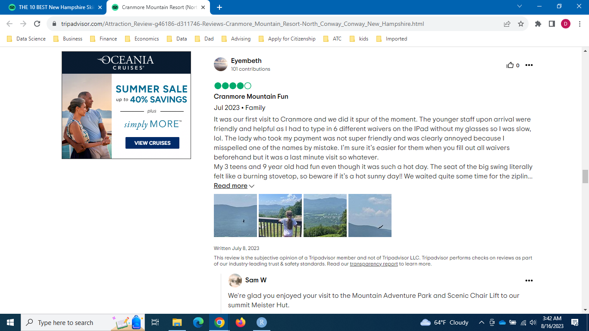

```{r echo=FALSE, warning=FALSE, message=FALSE}
library(tidyverse)
library(tidyquant)
library(tidytext)
library(DT)

map3 <- read_rds("../../../../Ski_areas/00_data/fig/map3.rds")

# plots
review_year_fig          <- read_rds("../../../../Ski_areas/00_data/fig/review_year_fig.rds")
review_month_fig              <- read_rds("../../../../Ski_areas/00_data/fig/review_month_fig.rds")
review_state_of_origin_fig <- read_rds("../../../../Ski_areas/00_data/fig/review_state_of_origin_fig.rds")
review_region_of_origin_fig         <- read_rds("../../../../Ski_areas/00_data/fig/review_region_of_origin_fig.rds")
review_country_of_origin_fig <- read_rds("../../../../Ski_areas/00_data/fig/review_country_of_origin_fig.rds")
review_skier_cat_fig        <- read_rds("../../../../Ski_areas/00_data/fig/review_skier_cat_fig.rds")
review_aspect_count_fig     <- read_rds("../../../../Ski_areas/00_data/fig/review_aspect_count_fig.rds")
review_aspect_avg_sentiment_fig <- read_rds("../../../../Ski_areas/00_data/fig/review_aspect_avg_sentiment_fig.rds")
review_aspect_wt_sentiment_fig  <- read_rds("../../../../Ski_areas/00_data/fig/review_aspect_wt_sentiment_fig.rds")
review_aspect_complaints_fig    <- read_rds("../../../../Ski_areas/00_data/fig/review_aspect_complaints_fig.rds")
review_aspect_wt_sentiment_by_season_fig <- read_rds("../../../../Ski_areas/00_data/fig/review_aspect_wt_sentiment_by_season_fig.rds")
```

This article first appeared in [danielleeconsulting.com.](https://danielleeconsulting.com/blog/2023-07-27-leveraging-data-analytics-to-address-seasonality-in-the-tourism-industry-insights-from-the-ski-business-part2/)

Step into the next part of our data exploration series, where we dig into the ups and downs of tourism across different times of the year. We're going to take a close look at what people say in their reviews and figure out how businesses can adjust what they offer based on the seasons.

In the last part, we talked about how teaming up with nearby attractions and businesses can bring in visitors all year long. Now, in this new adventure, I've looked at what people are saying online, like on Tripadvisor. It's like finding hidden treasure in a digital world, where we can learn about the people who visit our state. We'll find out who come here each year, when they come, where they come from, what they like, and what they don't like.

In the United States, many state tourism groups ask research companies to collect info for them. But, these companies have some limitations. One issue is that the people they ask might not represent all the different types of tourists. For example, if they only ask people from the U.S., they won't know about visitors from other countries. Also, sometimes they might not ask enough people, especially in small states like New Hampshire. This can make it hard to really understand things in a detailed and reliable way. Plus, the info they collect is like snapshots taken every once in a while, so it might not show the real changes happening right now. The online customer feedback is an alternative data that could complement existing data in the tourism world.

Looking forward, we've got Part 4 coming up next week. It's like the next chapter in our story. We will construct a machine learning model to identify the key variables that significantly impact customer ratings, allowing businesses to enhance their overall performance.

Lastly, just a little reminder: even though we're talking about skiing as an example, the same methdology can apply for other types of tourism. The tips and ideas we're discovering can fit many other businesses in the tourism world. So, let's keep exploring and see how we can make our journeys even better!

## Data

If you're curious about the data we're using, head over to the Data section in Part 1. Click [this link](https://danielleeconsulting.com/blog/2023-07-19-addressing-seasonality-in-the-tourism-industry-insights-from-the-ski-business-part1/) for Part 1. We retrieved online cutomer reviews about ski areas in three states up north: Maine, New Hampshire, and Vermont from Tripadvisor. The photo below shows an example of the customer reviews used in this analysis. 

<br>
<br>

{width=100%} 

<br>
<br>

We collected information from a huge batch of 8,012 customer reviews. These reviews are like a goldmine of knowledge about the people who went to the ski areas. Besides the reviews themselves, we also got other details, like when the review was written, what kind of skier the person was (like if they went with family, friends, etc.), and where they came from. But not all reviews spilled all the beans, so we needed to tidy things up a bit.

-   **Review Date**: In a big 93% of the reviews, they told us the date when they wrote it, including the month and year. This helps us see what people like in different seasons. But, just so you know, the date they wrote the review doesn't always match when they actually went on the trip. However, our analysis showed that people usually write reviews pretty soon after they come back from their trip.

-   **Place of Origin**: We sorted out the addresses people gave us. For this, we created three places of origin variables: U.S. states, U.S. regions, and countries. But not all the self-reported addresses were super clear. Some only mentioned the city, which isn’t enough to know where they’re from, so we couldn’t use those. The addresses needed the city and the state (or country) to be identifiable. We did guess some big cities in the U.S. Northeast. For example, if someone said they were from Boston, we figured they meant Massachusetts. The same goes for NYC (that’s New York State) and Philadelphia. The region variable represents the U.S. Census geographic unit of divisions, and we could figure out the country in 82% of the reviews, the state in 73%, and the region in 74%.

-   **Skier Categories**: Reviewers also told us if they were part of a family, a couple, with friends, or by themselves. A good 74% of the reviews had this info.

-   **Sentiment**: We delved into the emotions expressed in customer feedback using a variant of aspect-based sentiment analysis, largely following Amanda Dobbyn's methodology.[^1] Here's how we tackled it:

    -   Step 1: We began by breaking down the customer review data into smaller pieces, or tokens (i.e., tokenization). We then simplified the words by turning them into their basic forms (i.e., lemmatization). We also figured out the type of word each one was, whether it's a noun, verb, or adjective (i.e., part of speech tagging).
    -   Step 2: Next, we selected only the important nouns that referred to different aspects of the ski business. These nouns were grouped into 12 categories, such as slopes, lifts, snow quality, and more. You can see the list of these nouns in the table below. I admit that this is an area I would consult with people in the industry and spend more time on when consulting. I used my common sense as a layman when selecting and categorizing words relevant to the ski business. 
    -   Step 3: After that, we identified sentences that contained these important nouns. It's worth noting that one sentence could touch on more than one aspect of the ski business.
    -   Step 4: To understand the sentiments in each sentence, we utilized a special tool called the sentimentr r package.[^2] This tool is pretty amazing. It takes into account negators (e.g., "I do not like it."), amplifiers (e.g., "I really like it."), de-amplifiers (e.g., "I hardly like it."), and adversative conjunction (e.g., "I like it but it's not worth it.").
    -   Step 5: We gathered all the sentiments from these sentences and averaged them per each aspect of the ski business. It gave us a general idea of how customers felt about each key aspect of the ski business.

[^1]: <https://monkeylearn.com/blog/sentiment-analysis-using-r/>

[^2]: <https://www.rdocumentation.org/packages/sentimentr/versions/2.9.0>

It's important to remember that this kind of analysis, known as Natural Language Processing (NLP), is more of an art than a precise science. While the field is making rapid progress, it's not always flawless. Despite its advancements, there are times when it may not perfectly capture the complexities of human expression.

| Categories of Nouns (Aspect) | Nouns                                                                                                                              |
|--------------------------|----------------------------------------------|
| slope                        | slope, slopes, groom, run, snowmaking                                                                                              |
| lift                         | lift, lifts, chairlift, gondola, gondolas                                                                                          |
| amenity                      | rental, rentals, school, lesson, lessons, restaurant, restaurants, cafe, cafeteria, cafeterias, lodge, lodges, restroom, restrooms |
| scenery                      | scenic, view, views                                                                                                                |
| terrain park                 | terrain, park, parks, halfpipe, jump, jumps                                                                                        |
| snow quality                 | snow                                                                                                                               |
| congestion                   | crowd, crowds, congestion                                                                                                          |
| staff                        | staff                                                                                                                              |
| parking                      | parking                                                                                                                            |
| safety                       | safety, aid, security                                                                                                              |
| entertain                    | entertainment, nightlife                                                                                                           |
| price                        | price, value                                                                                                                       |

## Mapping Sentiment of Customer Reviews

The map below displays the average sentiment of customer reviews for ski areas across the northern New England states. By hovering over specific locations on the map, operators can access detailed information about each ski area, including ratings and types of offerings. Furthermore, the interactive map offers a zoom functionality that allows operators to focus on specific regions of interest. By clicking on the plus sign, '+', located in the upper right corner of the map, operators can zoom in and examine smaller areas of multiple ski areas. This zoom feature proves particularly useful when exploring regions with a high concentration of ski areas, such as southern Vermont.Please click the reset button to revert the map back to its original state.

Now, let's explore the interactive map that showcases how customers generally felt about the ski areas in the northern New England states. The map gives you an idea of the average emotions expressed in the customer reviews.

But, it's important to approach the interpretation of this average sentiment at the individual ski area level with care. Why? Well, the estimates are based on a small number of customer reviews for some ski areas. This is especially noticeable in the case of Maine. So, while the map provides a valuable overview, remember to consider these factors when zooming in on specific ski areas.

```{r echo=FALSE, warning=FALSE, message=FALSE, fig.width=8, out.width="100%"}
map3
```

## Analysis

### Distribution of Customer Reviews: Review Date

Let's delve into the insights presented by the chart below, which offers a visual representation of how customer reviews are distributed across various years. The plot provides a clear depiction of how the bulk of the 8,012 reviews we analyzed were posted before the COVID era, specifically spanning the years 2011 to 2020. Many of the 2020 reviews are likely from the first three months of winter, granting us a snapshot of the period just before the pandemic emerged.

```{r echo=FALSE, warning=FALSE, message=FALSE, fig.width=8, out.width="100%"}
review_year_fig
```

The graph below illustrates the monthly breakdown of reviews. This pattern aligns with our knowledge of the ski seasons in the northern New England region. Typically, the peak ski season falls between December and the following March, while April, May, and November mark the transition periods known as shoulder seasons. Additionally, the chart reveals a significant influx of visitors to the ski areas during the summer and fall months. This dynamic distribution offers a visual narrative of the various seasons' influence on visitor activity.

```{r echo=FALSE, warning=FALSE, message=FALSE, fig.width=8, out.width="100%"}
review_month_fig
```

### Distribution of Customer Reviews: Place of Origin

The visual representation below showcases the home states of the skiers who ventured to the ski areas. Unsurprisingly, Massachusetts takes the lead by a significant margin, holding the top spot. Following behind is New York, although at a considerable distance. It's worth noting that the top 10 states on this list all hail from the Northeast region of the United States, with a notable outlier being Florida.

Beyond this regional focus, the data brings to light a broader attraction, drawing skiers from across the entire country. Impressively, the information reveals that reviewers originate from 49 states, along with the inclusion of the District of Columbia. This diverse and extensive representation highlights the wide-reaching appeal of the ski industry, which captures the attention of enthusiasts from all corners of the nation.

```{r echo=FALSE, warning=FALSE, message=FALSE, fig.width=8, out.width="100%"}
review_state_of_origin_fig
```

Moving on to the subsequent graph, we've classified skiers into nine distinct regions, specifically utilizing Divisions, which are a geographical unit of the U.S. Census. This visual representation affirms the ski areas' remarkable ability to draw in enthusiasts from every corner of the United States. However, a significant concentration of skiers primarily emerges from the East Coast, portraying a prominent regional focus. This insight further underscores the appeal of these ski destinations across the nation while highlighting the dominant pull from the eastern parts of the country.

```{r echo=FALSE, warning=FALSE, message=FALSE, fig.width=8, out.width="100%"}
review_region_of_origin_fig
```

Now, let's shift our focus to the graph below, which presents the reviewers' countries of origin. A primary observation is that the industry predominantly attracts skiers from within the country, reflecting a significant domestic interest. However, the presence of skiers from Canada and the United Kingdom cannot be ignored, adding to the diverse pool.

The list of the top 10 countries underscores the industry's strong allure for Western nations, encompassing Europe, Oceania, and North America. Notably, this selection excludes representation from Asia and Latin America. While the top countries exhibit a regional trend, it's important to acknowledge that the data do reveal skiers hailing from 57 countries outside the United States. This broader perspective indicates that the ski areas have a global appeal that transcends national borders, fostering an international community of ski enthusiasts.

```{r echo=FALSE, warning=FALSE, message=FALSE, fig.width=8, out.width="100%"}
review_country_of_origin_fig
```

### Distribution of Customer Reviews: Skier Category

Turning our attention to the chart below, we uncover intriguing insights into the company skiers kept during their visits. Notably, families emerge as the leading group, a testament to the family-friendly allure of these ski areas. Equally noteworthy are the subsequent three categories, each contributing significantly to the visitor composition. A point of interest lies in the relatively modest representation of the business group, which stands out as comparatively smaller.

The data's illumination of these different companionship categories holds profound implications for marketing strategies and product development within the ski industry. These insights offer a valuable roadmap for ski areas to carve out their distinct niches by honing in on particular categories of skiers. By capitalizing on this understanding, ski areas can tailor their offerings to cater to specific preferences, fostering an environment that resonates deeply with their chosen target audience.

```{r echo=FALSE, warning=FALSE, message=FALSE, fig.width=8, out.width="100%"}
review_skier_cat_fig
```

### Aspect Sentiment

Take a look at the chart below, which sheds light on the quantity of sentences discussing different categories or aspects of the ski business. Notably, the most frequently discussed category is "amenity" (which covers things like restaurants, restrooms, ski schools, and ski lessons). Right on its heels is the category of "lift," capturing substantial attention. In contrast, "entertainment" emerged as the least frequently talked about aspect.

This frequency distribution of mentions for each category carries significant weight, as it offers insight into what matters most to people. The data indicates the importance of directing attention towards amenity and ski lift operations within the ski areas. By understanding these areas of focus, ski areas can make informed decisions to enhance these aspects, ensuring they align with the desires and priorities of their visitors.

```{r echo=FALSE, warning=FALSE, message=FALSE, fig.width=8, out.width="100%"}
review_aspect_count_fig
```

Our attention now shifts to the subsequent graph, which illustrates the average sentiment associated with each category. To arrive at these values, we calculated the sentiment score of sentences within each category and then took an average. It's important to recognize that, on the whole, people have positive feelings about all aspects of the ski resorts.

To gauge the relative performance of ski areas across each category, we introduced a sentiment valence variable, organized into three groups: "good" (top third), "meh" (middle third), and "bad" (bottom third). Even in the "bad" category, the sentiment remains positive, underlining the overall satisfaction of visitors. A closer look at these sentiment valence groups reveals that people hold a high level of contentment with the staff at the ski areas. On the other hand, there's room for improvement in areas such as congestion, lift operations, and parking, where satisfaction levels are comparatively lower. This nuanced analysis provides valuable insights into the specific areas that may benefit from focused enhancements within the ski resort experience.

```{r echo=FALSE, warning=FALSE, message=FALSE, fig.width=8, out.width="100%"}
review_aspect_avg_sentiment_fig
```

Now, let's delve into the subsequent graph, which presents the concept of weighted average sentiment. While the average sentiment provides insight into people's feelings, it doesn't consider the aspect's importance. To address this, we introduce a weighted approach, calculated by multiplying the average sentiment by the frequency of sentences within each aspect.

As showcased in the chart below, certain aspects emerge distinctly. First and foremost, "staff" shines as an area where ski areas have excelled in both performance and significance. This is evident from its high average sentiment score, coupled with the substantial number of times it's mentioned. The combined effect highlights "staff" as a pivotal and high-performing aspect.

On the flip side, "entertainment" stands out as an aspect that garnered high average sentiment scores, but its relatively infrequent mentions indicate lower importance. Conversely, "lift" emerges as an area with room for enhancement. This is inferred from its relatively lower sentiment score, coupled with its frequent mention. The data suggests that "lift" is an aspect that requires prompt attention and potential improvement.

By considering both sentiment and frequency, this analysis paints a comprehensive picture of the significance and performance of different aspects within the ski resort experience.

```{r echo=FALSE, warning=FALSE, message=FALSE, fig.width=8, out.width="100%"}
review_aspect_wt_sentiment_fig
```

In the plot below, we narrow our focus to the analysis of reviews with negative sentiment. This spotlight on complaints provides valuable insights into the specific aspects that trigger dissatisfaction. Notably, "lift" emerges as the most frequently mentioned topic when people express grievances. Following are "amenity" and "snow quality."

However, when we delve into the average sentiment, an interesting pattern emerges. Among the aspects mentioned in negative reviews, "safety" takes the lead as the least satisfactory aspect on average. This sheds light on the heightened concern visitors express regarding safety when voicing discontent. Notably, "staff" claims the second spot in terms of dissatisfaction on average in negative reviews, which contrasts with our earlier understanding. Recall from previous charts that "staff" was highlighted as the most satisfactory aspect when considering all reviews.

Upon delving into the weighted average sentiment, "lift" once again takes center stage. Its consistent prominence as a critical area requiring attention becomes apparent. This analysis reaffirms the need for immediate focus on enhancing the "lift" experience, considering its importance and impact on visitor sentiment, particularly in cases of dissatisfaction.

```{r echo=FALSE, warning=FALSE, message=FALSE, fig.width=8, out.width="100%"}
review_aspect_complaints_fig
```

As we reach the culmination of our journey, the upcoming plot addresses the ultimate query: how do we navigate seasonality and understand the ebb and flow of skiers' preferences and expectations across different times of the year? Here's what we've uncovered:

A standout revelation is the aspect of "scenery." In contrast to the winter ski season, where it's not a prominent factor, the scenery becomes a vital aspect of the ski area experience during other seasons. Fortunately, people tend to feel satisfied with the scenery they encounter.

Next on the radar is the lift experience, which takes on varying degrees of satisfaction. Interestingly, dissatisfaction with lifts appears to be a less significant concern during the summer season compared to the winter

Price also displays some seasonal fluctuations in relative importance. It appears to have a relatively higher significance during the summer months than during the winter season.

Lastly, an intriguing observation is the occurrence of some summer reviews mentioning winter-specific aspects, such as "snow quality." This peculiarity may stem from a discrepancy between the review date and the actual visit date, highlighting the potential challenges in drawing accurate insights from such instances.

Although it is the last plot we present here, we only scratched the surface of this rich data. The approach we’ve used for dissecting sentiment based on different seasons can be extended to other facets of the data. For instance, we could break down sentiment for foreign versus domestic skiers or for family skiers versus couples. The wealth of information within the online customer review data offers invaluable clues to a myriad of questions we may have.

```{r echo=FALSE, warning=FALSE, message=FALSE, fig.width=8, out.width="100%"}
review_aspect_wt_sentiment_by_season_fig
```

# Actionable Insights

Based on the comprehensive analysis we've conducted, several actionable insights emerge for ski areas and businesses operating within the tourism industry:

1.  **Optimize Lift Operations:** Address dissatisfaction with lift experiences, especially during the winter season. Improving lift operations, reducing wait times, and enhancing overall efficiency can contribute to a more positive visitor sentiment, particularly in colder months.

2.  **Enhance Scenic Experiences:** Recognize the shifting importance of "scenery" across different seasons. While it might not be a focal point during the winter, it becomes a crucial aspect in other seasons. Investing in maintaining and showcasing scenic beauty can significantly enhance the visitor experience.

3.  **Fine-Tune Pricing Strategies:** Acknowledge the varying significance of "price" during different seasons. During the summer, pricing could carry relatively more weight in influencing visitors' experiences. Consider competitive pricing, discounts, and attractive packages to cater to these seasonal fluctuations in visitor priorities.

4.  **Focus on Staff Satisfaction:** Build on the already positive sentiment associated with "staff." Staff interactions play a pivotal role in shaping visitors' perceptions. Invest in staff training, customer service, and employee well-being to consistently deliver exceptional experiences.

5.  **Leverage Niche Marketing:** Utilize insights into visitors' preferences to craft niche marketing strategies. Tailor offerings and promotions based on specific audience segments, such as families, couples, or international visitors, to cater to diverse needs and expectations.

6.  **Holistic Seasonal Planning:** Incorporate the understanding of seasonal shifts in skiers' preferences into your planning. Create dynamic offerings and experiences that align with visitors' expectations during different times of the year, ensuring a consistent and satisfying visit across seasons.

7.  **Continuous Monitoring and Adaptation:** Recognize that visitor preferences and sentiments may evolve over time. Regularly monitor and analyze customer feedback, adapting strategies and offerings accordingly to maintain a strong and positive visitor experience.

Incorporating these insights into your business strategies can lead to a more tailored and responsive approach, optimizing visitor satisfaction, and ultimately contributing to the growth and success of ski areas and tourism ventures.

# Conclusion

To sum it all up, Part 3 has shown us how important it is to listen to what customers say online. We've learned a lot about what skiers like and want in different seasons.

Looking forward to Part 4, we will construct a machine learning model to identify the key variables that significantly impact customer ratings, allowing businesses to enhance their overall performance.

I want to say a big thank you for being a part of this journey with me. I'm excited to keep exploring together next week. Stay curious and keep that sense of adventure alive!
